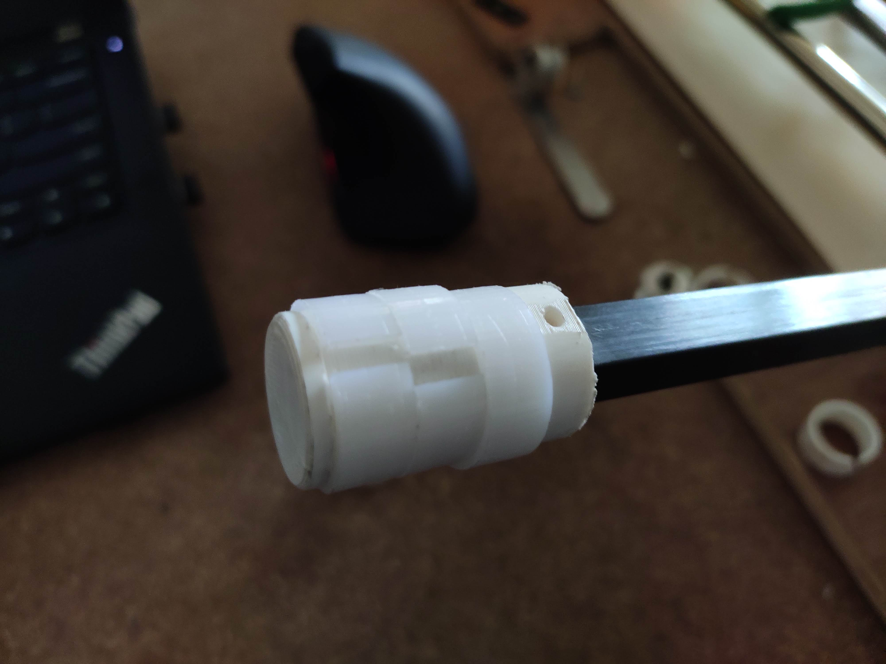

# VR-Archery

Converting an Archery Bow into a VR Game Controller. The haptic feedback provided by the bow enhances the experience for the user in the VR game.

<h3>The problem,</h3>

Using a real bow with tight strings means when the bow is pulled back a lot of energy is stored. This is released when we let go of the string, usually, the arrow absorbs the energy and travels away from the bow, but in the case of a stationary arrow the energy transmitted to the arrow must be absorbed back by the bow.

<h3>The solution</h3>

The way this problem is solved without affecting the user experience too much is to use air resistance to absorb most of the energy. This is accomplished by converting the arrow into a piston and putting it inside a cylinder. When we move the piston back and forth the change in air pressure provides resistance to motion.

The amount of air resistance is proportional to the square of the velocity. So loose fitting pistons are ideal, else it would be like a syringe.

## Version 1

#### 66" Bow with a 32mm piston and cylinder

Larger bow needs a bigger piston and cylinder arrangement. The only problem was the larger bow was heavy and it would tire out the players after 2 mins of playing. So we switched to a lighter bow that would give the same feel.

## Version 2

#### 55" Bow with a 25mm Piston and Cylinder

This is a kids bow with 3d printed supports for the piston and the cylinder. The arrow was replaced by 10mm carbon tubes to provide rigid motion and supports for the HTC vive tracker are printed on the arrow and the bow to track the players movement.

piston rings as seen on an automobile engine are used to provide abrasion resistance and tight air seals without close tolerances.

