# VR-Archery
Converting a Archery Bow into a VR Game Controller

## Version 1

#### 66" Bow with a 32mm piston and cylinder

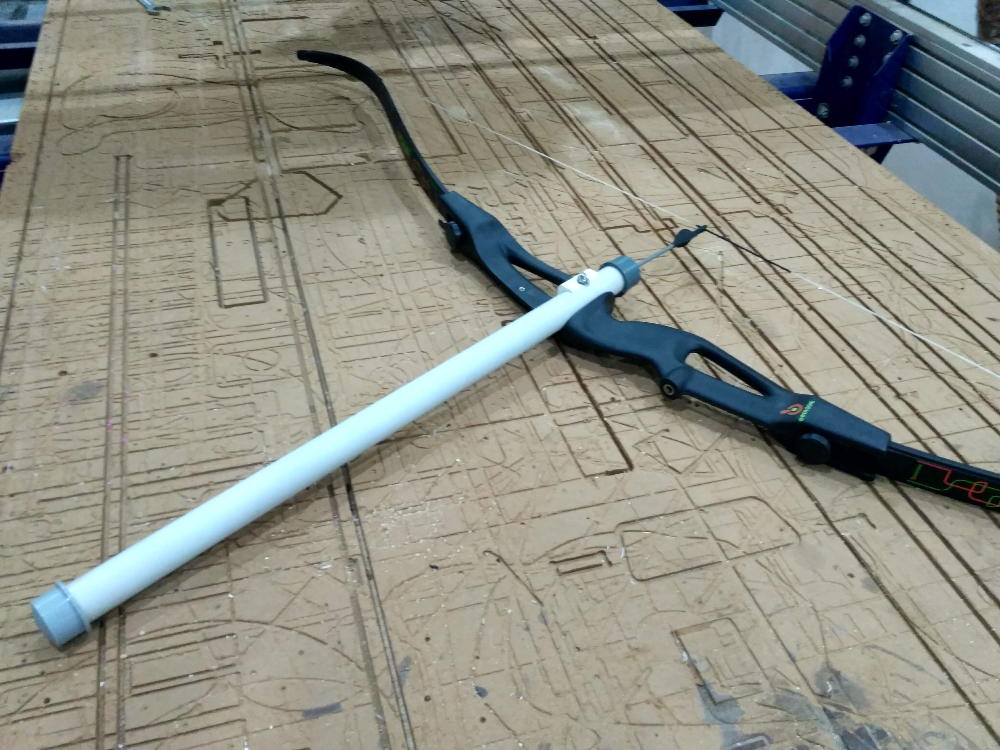

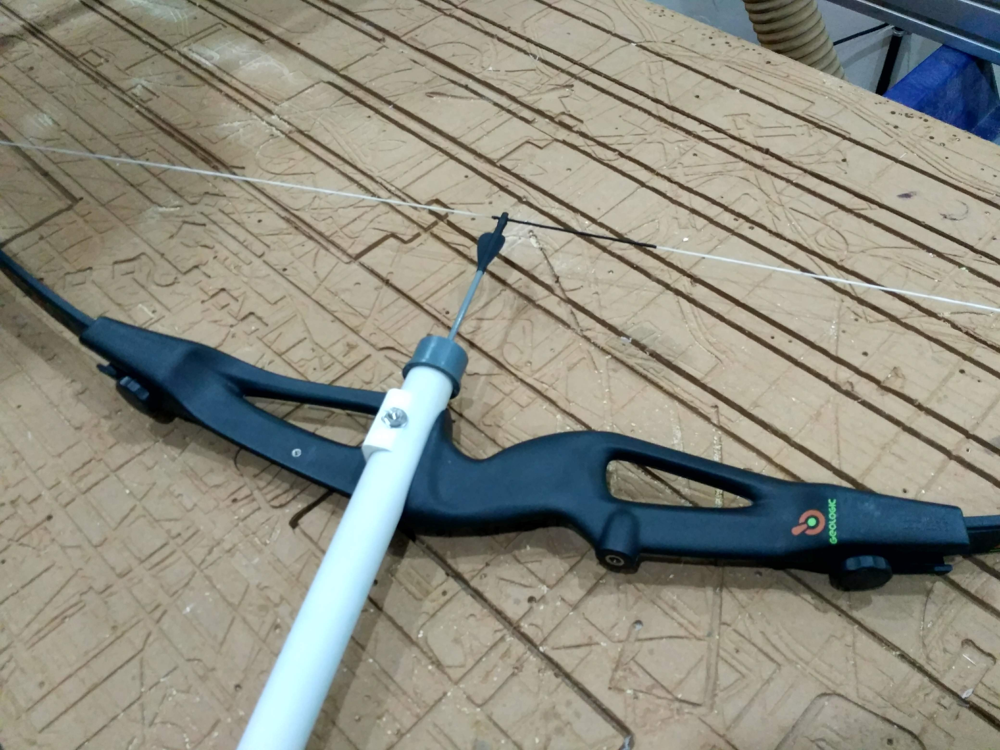

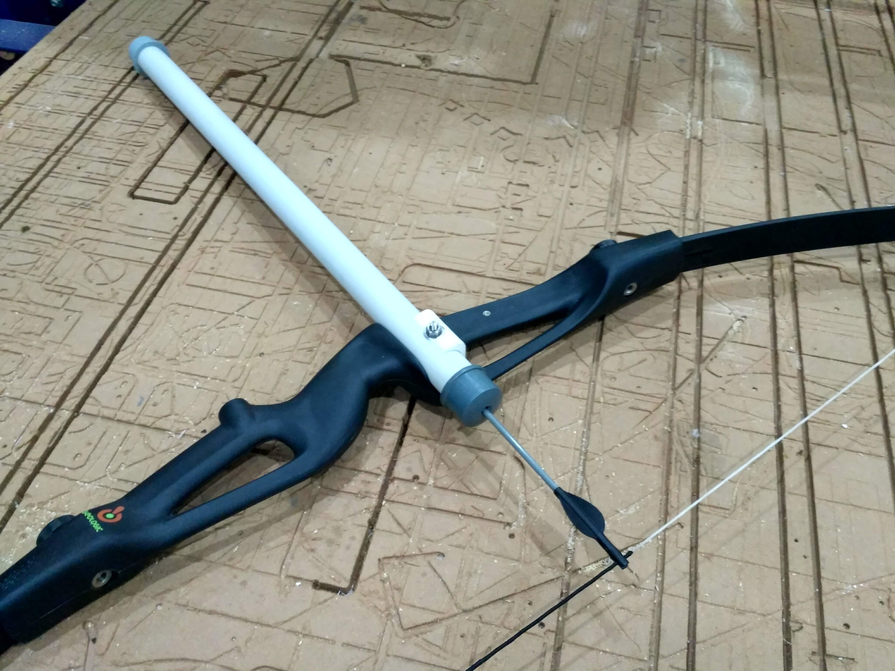

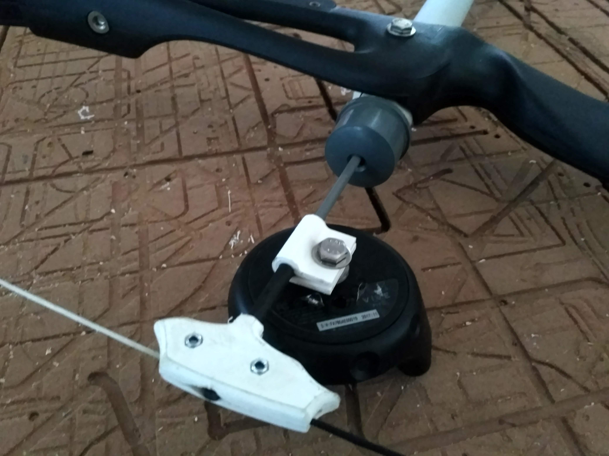

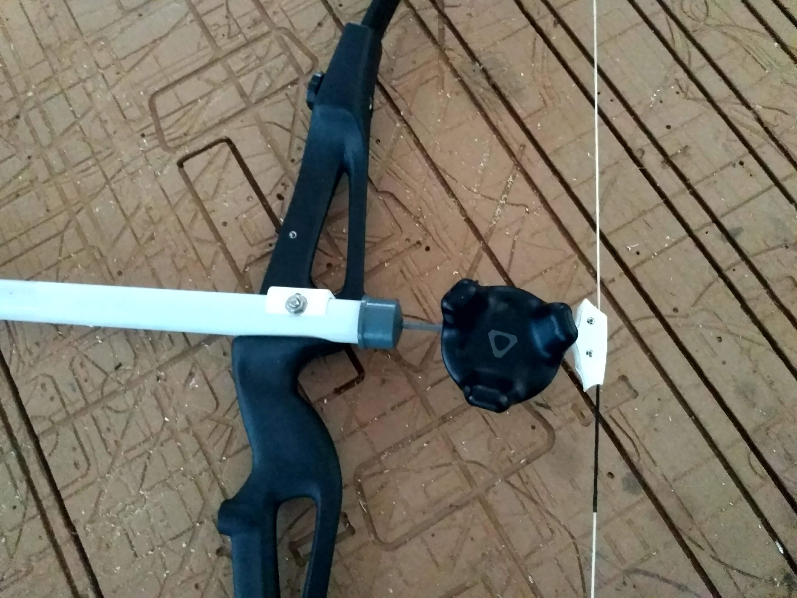

## Version 2

#### 55" Bow with a 25mm Piston and Cylinder

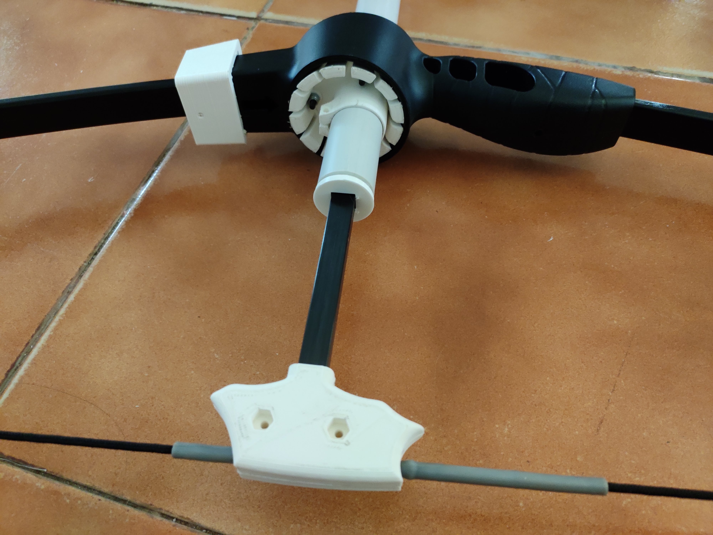

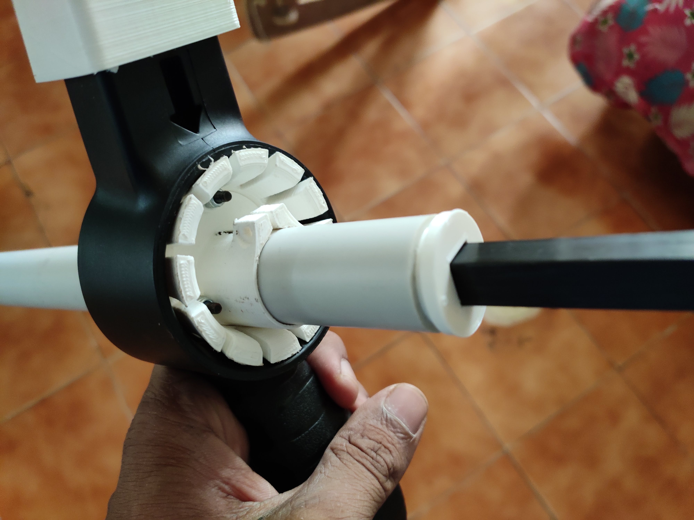

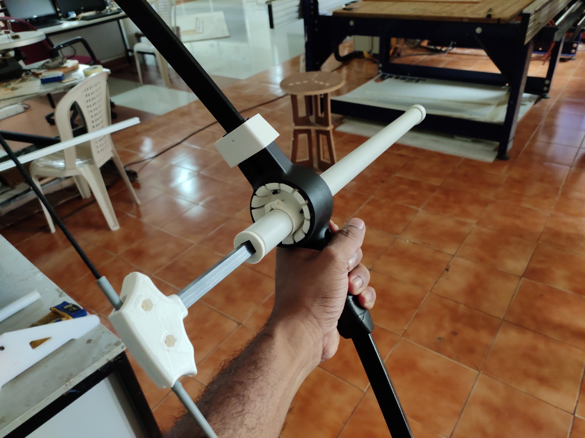

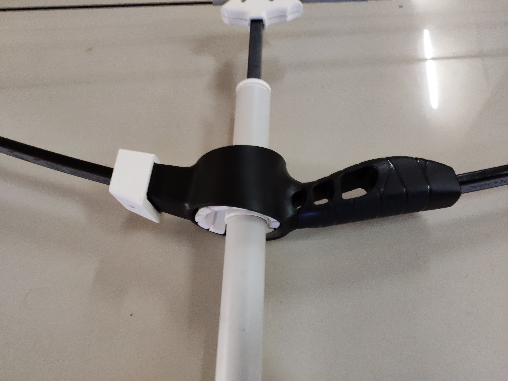

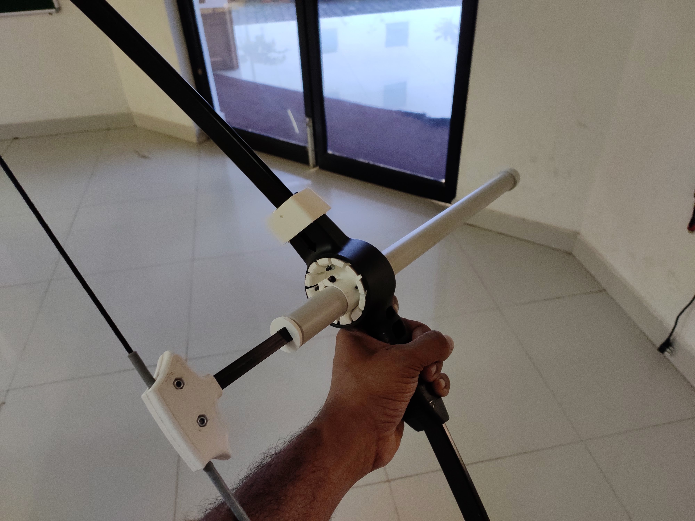

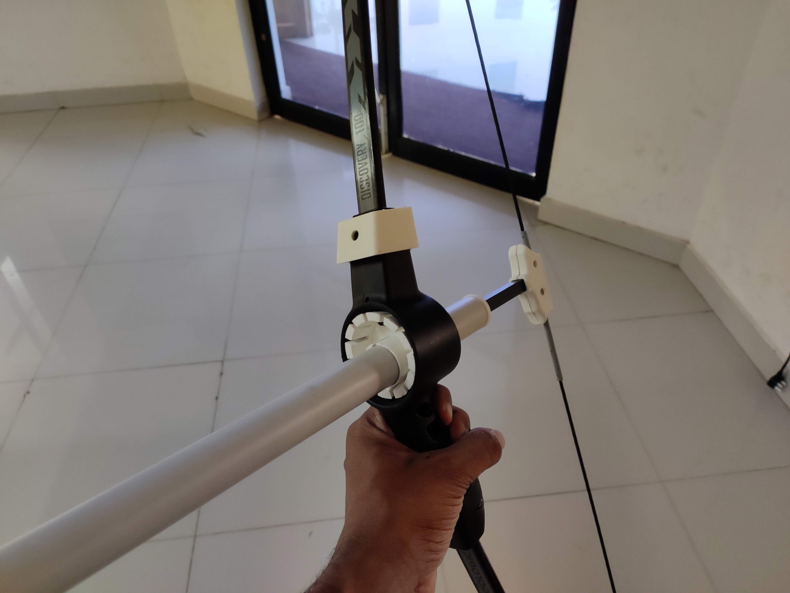

